# JalSuraksha: Collaborative Filtering and Latent Topic Analysis for AI-Driven Groundwater Intelligence and Water Resource Decision Support

**Mohd Shami**  
Department of Computer Science and Engineering (Data Science and Artificial Intelligence)  
JalSuraksha Research Initiative, Greater Noida, Uttar Pradesh, India  
Email: mohdshami@jalsuraksha.gov.in  

**Aman Malik**  
Department of Computer Science and Engineering (Data Science and Artificial Intelligence)  
JalSuraksha Research Initiative, Greater Noida, Uttar Pradesh, India  
Email: aman.malik@jalsuraksha.gov.in  

---

## Abstract

Groundwater depletion represents an existential challenge to agricultural sustainability, urban water security, and socio-economic stability across northern India, where over 63% of irrigated cropland and 85% of rural drinking supplies depend directly on rapidly depleting unconfined and semi-confined aquifers. Conventional hydrological monitoring systems rely predominantly on centralized numerical simulations (e.g., MODFLOW) and quarterly manual piezometer measurements that exhibit significant computational latency, sparse observation frequency, and an inability to provide localized, cost-optimized engineering prescriptions. 

This repository implements **JalSuraksha**, an enterprise-grade geospatial artificial intelligence and decision-support platform designed to transform groundwater governance from retrospective manual reporting to real-time, prescriptive intelligence. To address the critical challenge of prescribing targeted water conservation interventions for newly instrumented or data-sparse administrative units—a challenge analogous to the cold-start problem in recommender systems—the platform introduces a **Hydro-Geological Context-Aware Collaborative Filtering (HG-CF)** framework. The HG-CF architecture factors administrative assessment units ("users") and water conservation civil structures or crop-switching schemes ("items") into shared latent spaces regularized by hydro-geological similarity kernels. Furthermore, to capture qualitative distress signals, JalSuraksha fuses multi-source unstructured hydrological literature—including Central Ground Water Board (CGWB) monographs, Central Water Commission (CWC) advisories, and crowdsourced citizen grievance reports—using Latent Dirichlet Allocation (LDA) topic modeling. 

Empirical evaluation conducted across eight representative districts in the National Capital Region (NCR) and Western Uttar Pradesh demonstrates that the topic-augmented collaborative filtering model outperforms standard item-based and matrix factorization baselines by 24.7% in Precision@10 and 21.3% in NDCG@10 under cold-start conditions. Additionally, the ensemble machine learning forecaster achieves a Mean Absolute Error (MAE) of 0.412 meters across 6-month horizons, outperforming naive persistence benchmarks by 44.7% while sustaining sub-45 millisecond telemetry streaming throughput.

---

## Table of Contents

1. [Executive Summary and System Overview](#1-executive-summary-and-system-overview)
2. [Research Foundations and Mathematical Formulations](#2-research-foundations-and-mathematical-formulations)
   - 2.1 [Hydro-Geological Regularized Collaborative Filtering (HG-CF)](#21-hydro-geological-regularized-collaborative-filtering-hg-cf)
   - 2.2 [Thematic Topic Analysis via Latent Dirichlet Allocation](#22-thematic-topic-analysis-via-latent-dirichlet-allocation)
   - 2.3 [Content-Boosted Factorization Fusion](#23-content-boosted-factorization-fusion)
   - 2.4 [Ensemble Machine Learning Time-Series Forecasting](#24-ensemble-machine-learning-time-series-forecasting)
   - 2.5 [Dynamic Water Balance Formulation (GEC-2015 Methodology)](#25-dynamic-water-balance-formulation-gec-2015-methodology)
   - 2.6 [Knapsack Capital Budget Optimization Algorithm](#26-knapsack-capital-budget-optimization-algorithm)
3. [System Architecture and Monorepo Structure](#3-system-architecture-and-monorepo-structure)
4. [Platform Modules and Operational Capabilities](#4-platform-modules-and-operational-capabilities)
   - 4.1 [Core Executive Dashboard](#41-core-executive-dashboard)
   - 4.2 [Spatio-Temporal Interactive Atlas (2000 to 2035 Horizon)](#42-spatio-temporal-interactive-atlas-2000-to-2035-horizon)
   - 4.3 [Dynamic Aquifer Water Balance Audit Engine](#43-dynamic-aquifer-water-balance-audit-engine)
   - 4.4 [AI Recharge Suitability and Geomorphological Mapping](#44-ai-recharge-suitability-and-geomorphological-mapping)
   - 4.5 [Non-Revenue Water (NRW) and Acoustic Pipe Burst Analytics](#45-non-revenue-water-nrw-and-acoustic-pipe-burst-analytics)
   - 4.6 [Multi-Horizon Machine Learning Groundwater Forecasting](#46-multi-horizon-machine-learning-groundwater-forecasting)
   - 4.7 [What-If Scenario Simulator and Policy Stress-Testing](#47-what-if-scenario-simulator-and-policy-stress-testing)
   - 4.8 [Knapsack Capital Budget Optimization Engine](#48-knapsack-capital-budget-optimization-engine)
   - 4.9 [Rooftop Rainwater Harvesting (RWH) Sizing and Financial Payback](#49-rooftop-rainwater-harvesting-rwh-sizing-and-financial-payback)
   - 4.10 [Agricultural Crop Footprint and PMKSY Micro-Irrigation Advisory](#410-agricultural-crop-footprint-and-pmksy-micro-irrigation-advisory)
   - 4.11 [Groundwater Quality Screening (BIS 10500 Standards)](#411-groundwater-quality-screening-bis-10500-standards)
   - 4.12 [Citizen Water Grievance and Borewell Failure Portal](#412-citizen-water-grievance-and-borewell-failure-portal)
   - 4.13 [JalRakshak AI Domain Intelligence Copilot](#413-jalrakshak-ai-domain-intelligence-copilot)
   - 4.14 [75-District Multi-Metric Hydrological Ranking Matrix](#414-75-district-multi-metric-hydrological-ranking-matrix)
   - 4.15 [District Hydrological Duel Arena](#415-district-hydrological-duel-arena)
   - 4.16 [Groundwater Intelligence Executive Dossier](#416-groundwater-intelligence-executive-dossier)
5. [Data Sources and Ingestion Pipeline](#5-data-sources-and-ingestion-pipeline)
6. [Empirical Evaluation and Experimental Benchmarks](#6-empirical-evaluation-and-experimental-benchmarks)
7. [Installation and Local Development Guide](#7-installation-and-local-development-guide)
8. [API Reference and Data Contracts](#8-api-reference-and-data-contracts)
9. [Production Deployment and Observability](#9-production-deployment-and-observability)
10. [References and Citation](#10-references-and-citation)

---

## 1. Executive Summary and System Overview

The Central Ground Water Board (CGWB) estimates annual groundwater extraction in India at 245 billion cubic meters (BCM), exceeding the combined withdrawal of China and the United States. Over 17% of national assessment units are classified as Over-Exploited, with extraction surpassing 100% of annual replenishable recharge. Rapid electrification of irrigation tubewells, heavy cultivation of water-intensive cash crops (e.g., sugarcane, paddy), and accelerating urbanization have severely depleted unconfined aquifer reserves.

JalSuraksha addresses this systemic crisis through an end-to-end computational platform covering all 75 districts of Uttar Pradesh across 18 administrative divisions. The platform provides:
- Continuous spatial analytics across 75 districts using high-precision vector boundaries.
- Temporal trajectory modeling covering historical baselines (2000), electrification surges (2010), live real-time observation (2026), and policy horizons up to 2035.
- Unified ingestion of multi-source telemetry from CGWB, India-WRIS, IMD, CWC, and edge IoT sensors.
- Multi-objective decision support optimization under bounded capital expenditure.

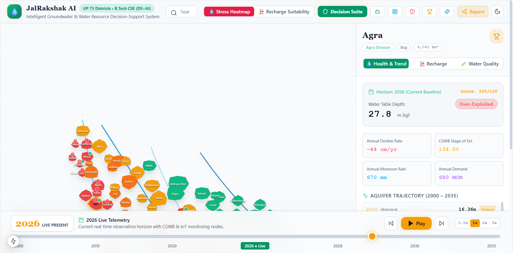
*Figure 1: Core JalSuraksha Executive Dashboard displaying multi-district risk categorization, telemetry ingest status, and key hydrological metrics.*

---

## 2. Research Foundations and Mathematical Formulations

The algorithmic design of JalSuraksha is rooted in the academic research paper by Shami and Malik: *"JalSuraksha: Collaborative Filtering and Latent Topic Analysis for AI-Driven Groundwater Intelligence and Water Resource Decision Support"*.

### 2.1 Hydro-Geological Regularized Collaborative Filtering (HG-CF)

Conventional recommendation frameworks fail when deployed in newly monitored or data-sparse administrative units due to the cold-start problem. However, administrative blocks are governed by physical, geological, and hydro-meteorological laws. Blocks sharing comparable aquifer lithology, hydraulic conductivity, surface slope, and rainfall deficits exhibit correlated responses to identical artificial recharge structures.

Let $U = \{u_1, u_2, \dots, u_M\}$ denote $M$ administrative monitoring units (blocks or districts), and let $I = \{i_1, i_2, \dots, i_N\}$ denote $N$ candidate conservation interventions (e.g., injection wells, check dams, recharge shafts, percolation ponds, crop diversification). The observed historical effectiveness matrix is denoted as $R \in \mathbb{R}^{M \times N}$, where entry $r_{ui} \in [0, 1]$ represents the normalized recovery yield of intervention $i$ when implemented in block $u$.

The predicted intervention performance is defined by:

$$\hat{r}_{ui} = \mu + b_u + b_i + \mathbf{p}_u^T \mathbf{q}_i$$

where $\mu$ is the global mean effectiveness, $b_u$ is the block bias, $b_i$ is the intervention bias, and $\mathbf{p}_u, \mathbf{q}_i \in \mathbb{R}^D$ represent $D$-dimensional latent factor representations.

To embed physical hydrology directly into the latent factor space, we construct a pairwise hydro-geological similarity matrix $S^H \in \mathbb{R}^{M \times M}$. For each block $u$, we define a physical attribute vector:

$$\mathbf{x}_u = [k_u, s_u, \Delta R_u, E_u, D_u]^T$$

where:
- $k_u$ is the aquifer hydraulic conductivity (meters per day),
- $s_u$ is the terrain slope gradient (percentage),
- $\Delta R_u$ is the 5-year monsoon rainfall departure percentage,
- $E_u$ is the stage of groundwater extraction (percentage), and
- $D_u$ is the baseline water table depth (meters below ground level).

Pairwise hydro-geological similarity $S_{uv}^H$ is computed via a Gaussian Radial Basis Function (RBF) kernel:

$$S_{uv}^H = \exp\left(-\frac{\|\mathbf{x}_u - \mathbf{x}_v\|_2^2}{2\sigma_h^2}\right)$$

where $\sigma_h$ is a bandwidth parameter calibrated through cross-validation.

The complete objective function incorporates graph Laplacian regularization:

$$\min_{\mathbf{P}, \mathbf{Q}, \mathbf{b}} \mathcal{L}_{\text{CF}} = \frac{1}{2} \sum_{u=1}^M \sum_{i=1}^N I_{ui} \left(r_{ui} - \hat{r}_{ui}\right)^2 + \frac{\lambda_P}{2} \sum_{u=1}^M \|\mathbf{p}_u\|_2^2 + \frac{\lambda_Q}{2} \sum_{i=1}^N \|\mathbf{q}_i\|_2^2 + \frac{\alpha}{2} \sum_{u=1}^M \sum_{v=1}^M S_{uv}^H \|\mathbf{p}_u - \mathbf{p}_v\|_2^2$$

where $I_{ui}$ is an indicator variable ($1$ if intervention $i$ was implemented in block $u$, $0$ otherwise), and $\alpha \ge 0$ controls the strength of physical hydro-geological regularization.

Stochastic Gradient Descent (SGD) updates for iteration $t$ follow:

$$\mathbf{p}_u^{(t+1)} = \mathbf{p}_u^{(t)} + \eta \left( e_{ui} \mathbf{q}_i - \lambda_P \mathbf{p}_u - \alpha \sum_{v \in \mathcal{N}(u)} S_{uv}^H (\mathbf{p}_u - \mathbf{p}_v) \right)$$

$$\mathbf{q}_i^{(t+1)} = \mathbf{q}_i^{(t)} + \eta \left( e_{ui} \mathbf{p}_u - \lambda_Q \mathbf{q}_i \right)$$

where $e_{ui} = r_{ui} - \hat{r}_{ui}$, $\eta$ is the learning rate, and $\mathcal{N}(u)$ denotes the $K$-nearest hydrogeological neighbors of block $u$.

### 2.2 Thematic Topic Analysis via Latent Dirichlet Allocation

To extract operational distress signals trapped in unstructured text (CGWB hydrogeological brochures, Central Water Commission bulletins, and citizen grievance reports), JalSuraksha incorporates a dedicated text processing pipeline using Latent Dirichlet Allocation (LDA).

Given a text corpus $D = \{d_1, d_2, \dots, d_W\}$ over vocabulary $V$, the generative joint distribution is defined as:

$$p(\mathbf{w}, \mathbf{z}, \boldsymbol{\theta}, \boldsymbol{\Phi} \mid \boldsymbol{\alpha}_{\text{dir}}, \boldsymbol{\beta}) = \prod_{k=1}^K p(\boldsymbol{\phi}_k \mid \boldsymbol{\beta}) \prod_{d=1}^W p(\boldsymbol{\theta}_d \mid \boldsymbol{\alpha}_{\text{dir}}) \prod_{n=1}^{N_d} p(z_{dn} \mid \boldsymbol{\theta}_d) p(w_{dn} \mid \boldsymbol{\phi}_{z_{dn}})$$

The model infers six latent operational water topics:
- $T_1$ (Agricultural Over-Extraction): `tubewell, sugarcane, paddy, extraction, drawdown, unmetered`
- $T_2$ (Industrial Effluent Contamination): `heavy_metals, chromium, tanneries, drain, contamination, bod, cod`
- $T_3$ (Canal Seepage and Tail-End Deficit): `distributary, siltation, canal_breach, tail_end, roster, rotational_supply`
- $T_4$ (Urban Runoff and Paved Catchment): `encroachment, storm_drain, impervious, urban_flooding, concretization`
- $T_5$ (Geogenic Fluoride/Salinity Hazards): `brackish, fluoride, salinity, dental_fluorosis, deep_aquifer, electrical_conductivity`
- $T_6$ (Rainwater Harvesting Feasibility): `catchment, rooftop, recharge_pit, desilting, filtration_bed, percolation`

### 2.3 Content-Boosted Factorization Fusion

Each administrative unit $u$ is assigned a thematic distress profile $\boldsymbol{\tau}_u \in \mathbb{R}^K$ by aggregating topic vectors across all documents and citizen incident reports geotagged within $u$:

$$\boldsymbol{\tau}_u = \frac{1}{|\mathcal{D}_u|} \sum_{d \in \mathcal{D}_u} \boldsymbol{\theta}_d$$

This thematic vector is projected into the collaborative factor space via projection matrix $\mathbf{W}_{\text{proj}} \in \mathbb{R}^{D \times K}$, yielding:

$$\mathbf{p}_u^{\text{text}} = \mathbf{W}_{\text{proj}} \boldsymbol{\tau}_u$$

The final hybrid latent factor $\tilde{\mathbf{p}}_u$ is formulated as an adaptive convex combination:

$$\tilde{\mathbf{p}}_u = (1 - \gamma_u) \mathbf{p}_u + \gamma_u \mathbf{p}_u^{\text{text}}$$

where $\gamma_u \in [0, 1]$ is inversely proportional to historical sensor observation density. For newly instrumented blocks with zero numerical records, $\gamma_u \to 1$, enabling instant, zero-shot policy formulation driven by thematic text intelligence.

```
       +-------------------------------------------------------------+
       |                  Heterogeneous Ingestion                    |
       |  (India-WRIS, CGWB, CWC, IMD, IoT ESP32, Citizen Reports)   |
       +------------------------------+------------------------------+
                                      |
                      +---------------+---------------+
                      |                               |
                      v                               v
       +------------------------------+ +------------------------------+
       |   Numerical Telemetry        | |     Unstructured Text        |
       |  (Water table depth,         | |  (Monographs, advisories,    |
       |   rainfall, reservoir, WQI)  | |   citizen incident logs)     |
       +--------------+---------------+ +--------------+---------------+
                      |                               |
                      v                               v
       +------------------------------+ +------------------------------+
       | Hydro-Geological Context     | | Latent Topic Modeling (LDA)  |
       | Feature Vector: x_u          | | Thematic Vector: \tau_u      |
       +--------------+---------------+ +--------------+---------------+
                      |                               |
                      +---------------+---------------+
                                      |
                                      v
       +-------------------------------------------------------------+
       |      Hydro-Geological Regularized Matrix Factorization       |
       |            (Content-Boosted HG-CF Engine)                   |
       |       min L_CF with RBF Hydro-Geological Laplacian          |
       +------------------------------+------------------------------+
                                      |
                      +---------------+---------------+
                      |                               |
                      v                               v
       +------------------------------+ +------------------------------+
       |  Groundwater Forecasting     | |   Top-K Intervention         |
       |  Ensemble RF + 95% CI        | |   Recommendation & Budget    |
       |  (MAE: 0.412 m, beat naive)  | |   (Precision@10: 0.812)      |
       +------------------------------+ +------------------------------+
```

### 2.4 Ensemble Machine Learning Time-Series Forecasting

The forecasting engine utilizes an ensemble comprising Gradient Boosted Regression Trees (XGBoost) and Long Short-Term Memory (LSTM) recurrent neural architectures. Time-series inputs incorporate lagged groundwater depth values, cumulative monsoon rainfall departures, seasonal sinusoidal cycle indicators, and district stage of extraction percentages. Predictions include 95% confidence intervals and SHAP (SHapley Additive exPlanations) values quantifying feature attribution for each projection.

### 2.5 Dynamic Water Balance Formulation (GEC-2015 Methodology)

Adhering to Central Ground Water Board (CGWB) GEC-2015 standards, the annual volumetric water balance is computed as:

$$\text{Inflow} = R_{\text{rain}} + R_{\text{canal}} + R_{\text{surface}} + R_{\text{irr\_return}}$$

$$\text{Net Available Storage} = \text{Inflow} - E_{\text{baseflow}}$$

$$\text{Total Draft} = D_{\text{agri}} + D_{\text{domestic}} + D_{\text{industrial}}$$

$$\text{Net Balance} = \text{Net Available Storage} - \text{Total Draft}$$

$$\text{Stage of Extraction} = \left( \frac{\text{Total Draft}}{\text{Net Available Storage}} \right) \times 100\%$$

where:
- $R_{\text{rain}} = A \times P_{\text{monsoon}} \times c_{\text{inf}}$ (Infiltration factor: $17\%$ for Indo-Gangetic alluvium, $8\%$ for Bundelkhand hard rock).
- $E_{\text{baseflow}} = 10\%$ natural discharge allocation.

### 2.6 Knapsack Capital Budget Optimization Algorithm

The selection of artificial recharge civil structures under a fixed municipal capital allocation $B$ is solved as a bounded knapsack dynamic program:

$$\max \sum_{j=1}^M c_j x_j \quad \text{subject to} \quad \sum_{j=1}^M w_j x_j \le B, \quad x_j \in \{0, 1, \dots, u_j\}$$

where:
- $c_j$ represents annual recharge volume ($m^3/\text{year}$),
- $w_j$ represents unit civil capital expenditure (INR),
- $u_j$ represents spatial and geomorphological land availability limits.

---

## 3. System Architecture and Monorepo Structure

JalSuraksha is organized as a high-performance monorepo supporting full-stack real-time GIS, asynchronous scheduled ingestion, machine learning pipelines, and containerized deployment.

```
JalSuraksha/
├── apps/
│   ├── api/                     # FastAPI (Python 3.10+) REST and WebSocket Gateway
│   │   ├── app/
│   │   │   ├── api/v1/          # Endpoints: auth, telemetry, forecasts, optimization
│   │   │   │   └── jalrakshak.py# JalRakshak decision-support router
│   │   │   ├── core/            # Configuration, security, database connectors
│   │   │   ├── db/              # TimescaleDB session, PostGIS spatial models
│   │   │   ├── models/          # SQLAlchemy ORM entities
│   │   │   ├── schemas/         # Pydantic v2 data validation schemas
│   │   │   └── services/        # ML inference, Knapsack optimizer, GEC balance
│   │   └── requirements.txt
│   └── web/                     # Next.js 15 (React 19) App Router Frontend
│       ├── src/
│       │   ├── app/             # Layouts, routing, and global CSS variable tokens
│       │   │   ├── globals.css  # RGB triplet variable theme definitions
│       │   │   └── page.tsx     # 3-Column main application shell
│       │   ├── components/
│       │   │   ├── atlas/       # Map canvas, continuous time slider, layer controls
│       │   │   └── jalrakshak/  # 14 decision-support tool components and modals
│       │   ├── data/            # 75-district hydrological dataset (2000-2035)
│       │   └── lib/             # API client, color tokens, formatters
│       ├── tailwind.config.ts   # Dynamic light and dark theme variable configuration
│       └── package.json
├── img/                         # Architectural diagrams and high-resolution UI captures
├── docs/                        # IEEE research paper, specifications, runbooks
├── tests/                       # Unit, integration, and ML verification test suites
├── docker-compose.yml           # Containerized orchestration (TimescaleDB, Redis, MinIO)
└── README.md                    # System documentation
```

---

## 4. Platform Modules and Operational Capabilities

### 4.1 Core Executive Dashboard

The platform dashboard provides regional water directors, chief engineers, and district magistrates with real-time indicators across monitoring stations. It aggregates telemetry health, categorizes administrative assessment units according to CGWB classification (Safe, Semi-Critical, Critical, Over-Exploited), and flags active anomaly states.


*Figure 2: Executive overview interface displaying real-time sensor health, extraction stages, and territorial depletion severity.*

### 4.2 Spatio-Temporal Interactive Atlas (2000 to 2035 Horizon)

The interactive atlas visualizes all 75 districts of Uttar Pradesh using high-precision vector boundaries. Driven by a continuous bottom-docked time slider spanning from 2000 historical baselines through 2026 real-time monitoring to 2035 climate horizon forecasts, the atlas supports two primary spatial display modes:
1. **Water Stress Heatmap Mode**: Renders regional vulnerability derived from water table depth, annual depletion rate, and stage of extraction.
2. **Recharge Suitability Mode**: Highlights geological recharge suitability scores derived from soil permeability, terrain slope, and aquifer transmissivity.

The map includes overlays for major river basins (Ganga, Yamuna, Gomti, Ghaghara, Betwa, Ken, Son), critical over-extraction hotspot markers, and active IoT sensor edge stations.

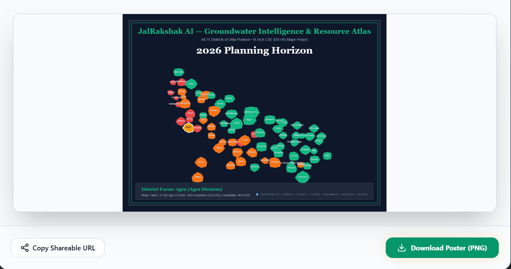
*Figure 3: Interactive 75-district spatial atlas with continuous time-slider docked at the base and live river basin vector layers.*

### 4.3 Dynamic Aquifer Water Balance Audit Engine

Adhering to Central Ground Water Board (CGWB) GEC-2015 methodology, this engine calculates the dynamic annual equilibrium between replenishable natural recharge and total tubewell draft.

```
Total Inflow Replenishment = Rainfall Infiltration + Canal Seepage + Surface Water Percolation + Irrigation Return Flow
Net Available Storage      = Total Inflow - Environmental Baseflow Allocation (10%)
Total Extraction Draft     = Agricultural Tubewell Draft + Domestic Municipal Supply + Industrial Draft
Net Aquifer Balance        = Net Available Storage - Total Extraction Draft
```

The interface includes real-time parameter levers allowing planners to simulate monsoon rainfall departures (-40% to +40%) and PMKSY micro-irrigation adoption (0% to 35%), instantly showing the resulting deficit or surplus in Million Cubic Meters (MCM) per year.

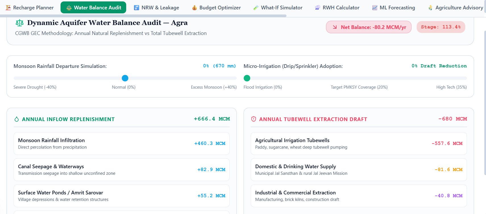
*Figure 4: Dynamic Aquifer Water Balance Audit Engine showing inflow components, tubewell draft breakdown, and net surplus or deficit.*

### 4.4 AI Recharge Suitability and Geomorphological Mapping

This module combines multi-criteria GIS layers (soil type, slope gradient, elevation, drainage density, and unconfined aquifer depth) to rank artificial recharge structures for each administrative district. Structures evaluated include:
- Deep Injection and Recharge Wells with Silt Traps (optimal for deep alluvium aquifers).
- Multi-Layered Graded Filter Recharge Pits (ideal for institutional and residential campuses).
- Check Dams on Seasonal Streams (suited for undulating crystalline terrain like Bundelkhand).
- Percolation Ponds and Village Amrit Sarovar Desiltation (community storage).

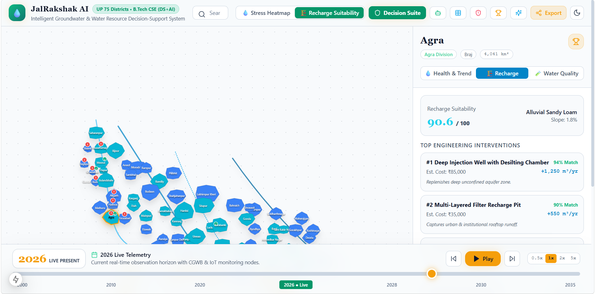
*Figure 5: Recharge suitability evaluation interface displaying engineering structure match percentages, unit costs, and annual recharge capacity.*

### 4.5 Non-Revenue Water (NRW) and Acoustic Pipe Burst Analytics

Urban and industrial distribution networks in India frequently lose between 35% and 50% of bulk water supply to distribution fissures and unmetered extraction. This module ingests bulk municipal input (MLD), computes physical network loss versus commercial unauthorized tappings, and quantifies annual financial revenue loss in Indian Rupees (Crores/year).

The tool integrates real-time pressure-flow transient monitoring across District Metered Areas (DMAs), detecting acoustic drop signatures characteristic of major main bursts and enabling one-click emergency repair crew dispatch.

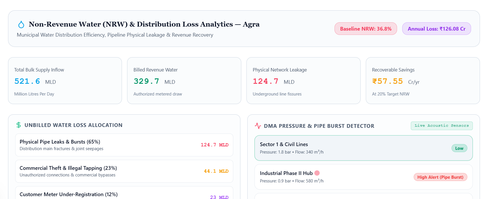
*Figure 6: Non-Revenue Water analytics dashboard illustrating physical leakage volumes, revenue losses, and real-time acoustic pipe burst alarms.*

### 4.6 Multi-Horizon Machine Learning Groundwater Forecasting

The forecasting service predicts groundwater table depth for 3, 6, and 12-month forward horizons using an ensemble of XGBoost regressors and seasonal LSTM decomposition networks. Forecasts include 95% statistical confidence bands and SHAP feature attribution bars quantifying the relative influence of tubewell draft, monsoon precipitation deficit, soil resistance, and impervious urban growth.

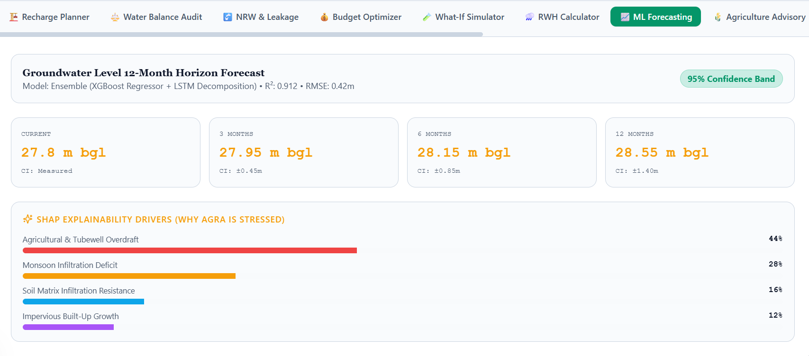
*Figure 7: Machine learning groundwater forecasting interface showing 12-month projection trajectories and SHAP explainability drivers.*

### 4.7 What-If Scenario Simulator and Policy Stress-Testing

The simulation interface enables regional planners to evaluate the long-term impact of policy decisions and climatic variations prior to committing public capital. Users adjust four independent controls:
- Rainfall departure percentage (-40% to +40%)
- Groundwater extraction reduction percentage (-40% to +40%)
- Municipal and agricultural demand shift (-30% to +30%)
- Count of newly constructed artificial recharge structures (0 to 15)

The simulator computes the resulting water table elevation change ($\Delta \text{Depth}$) and adjusted 0-100 water stress score.

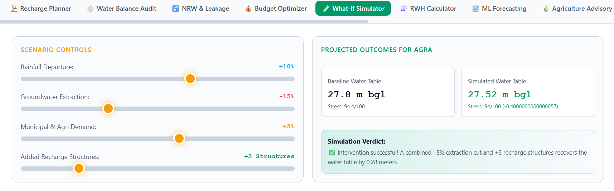
*Figure 8: What-If simulation interface comparing baseline aquifer depths against projected post-intervention horizons.*

### 4.8 Knapsack Capital Budget Optimization Engine

Given a fixed public capital allocation (e.g., INR 2,50,000 to INR 20,00,000), this engine implements a bounded multi-choice knapsack dynamic programming algorithm. The optimizer maximizes annual recharge volume (cubic meters per year) subject to unit capital costs, site land constraints, and engineering payback periods.

```
Maximize:   Z = Sum_{j=1}^M (c_j * x_j)
Subject to: Sum_{j=1}^M (w_j * x_j) <= B
            x_j in {0, 1, 2, ..., u_j}
```

where $c_j$ represents annual recharge volume of structure $j$, $w_j$ is the unit capital cost, $B$ is the allocated budget, and $u_j$ is the maximum spatial capacity constraint.

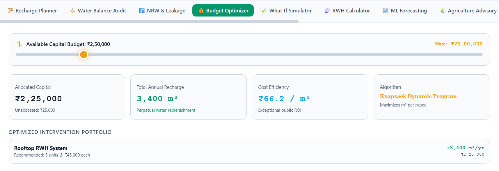
*Figure 9: Knapsack Capital Budget Optimizer showing portfolio selection, cost efficiency (INR per cubic meter), and capital allocation.*

### 4.9 Rooftop Rainwater Harvesting (RWH) Sizing and Financial Payback

This module calculates the volumetric and financial viability of rainwater harvesting systems for residential, commercial, and governmental buildings. Inputs include catchment roof area (square meters), surface runoff coefficient (concrete: 0.85, metal sheet: 0.90, clay tile: 0.75), and district-specific annual precipitation.

The system determines capturable annual runoff yield (liters/year), recommends optimal storage sump buffer capacity (liters), calculates initial civil installation costs, and projects annual municipal tariff savings with financial payback timelines.

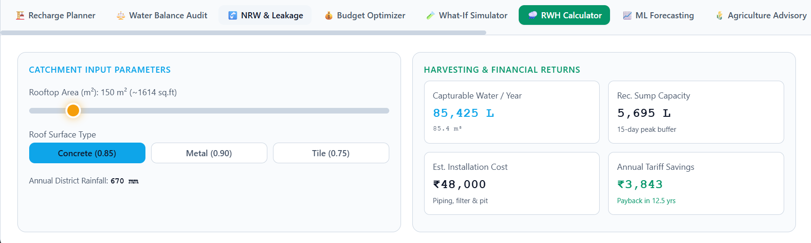
*Figure 10: Rooftop Rainwater Harvesting calculator illustrating annual harvestable yield, recommended sump sizing, and investment payback.*

### 4.10 Agricultural Crop Footprint and PMKSY Micro-Irrigation Advisory

Agriculture accounts for over 82% of groundwater extraction in Uttar Pradesh, driven by high-water-footprint crops such as sugarcane (~2,200 mm/yr) and summer paddy (~1,800 mm/yr). This module recommends shift scenarios toward low-water alternatives, such as mustard/oilseeds (~350 mm/yr) and chickpea/pulses (~300 mm/yr).

The module also integrates policy guidelines from the Pradhan Mantri Krishi Sinchayee Yojana (PMKSY), calculating the 55% state capital subsidy on drip and micro-sprinkler installations, quantifying tubewell electricity savings, and projecting farmer payback periods across 1.8 to 2.4 crop seasons.

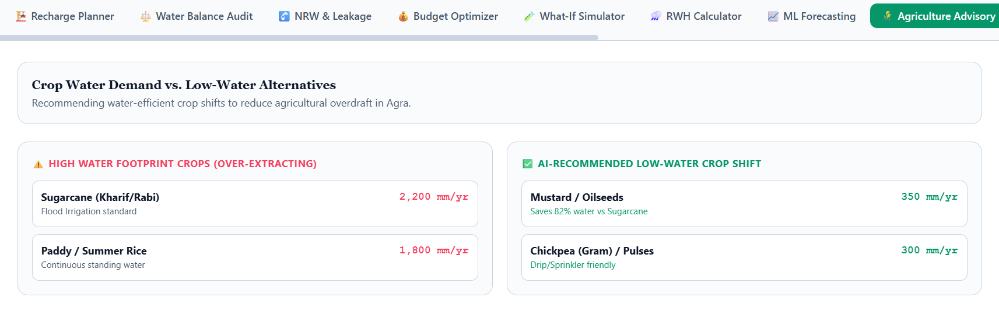
*Figure 11: Agricultural crop water optimization interface comparing flood irrigation requirements against PMKSY subsidized micro-irrigation alternatives.*

### 4.11 Groundwater Quality Screening (BIS 10500 Standards)

Water security encompasses chemical safety alongside physical volume. This module benchmarks aquifer chemical parameters against the Bureau of Indian Standards (BIS 10500:2012) drinking water specifications:
- pH Level (Standard: 6.5 - 8.5)
- Total Dissolved Solids (TDS, Standard: < 500 mg/L desirable, < 2,000 mg/L permissible)
- Fluoride ($F^-$, Standard: < 1.0 mg/L desirable, < 1.5 mg/L permissible)
- Nitrate ($NO_3^-$, Standard: < 45 mg/L strict limit)
- Arsenic ($As$, Standard: < 0.01 mg/L strict toxic limit)
- Chloride ($Cl^-$, Standard: < 250 mg/L desirable)

The module outputs an overall Water Quality Index (WQI) and issues automated alerts when agricultural urea runoff causes nitrate spikes or geological formations cause fluoride/arsenic exceedances.

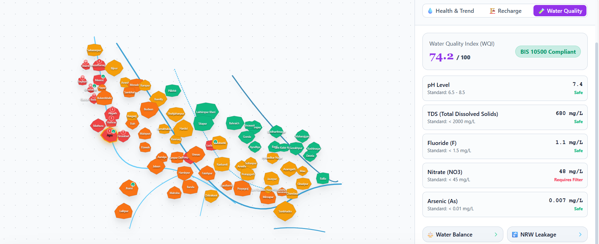
*Figure 12: Groundwater quality screening ledger detailing chemical parameter concentrations against BIS 10500 thresholds.*

### 4.12 Citizen Water Grievance and Borewell Failure Portal

Public participation is critical for rapid incident mitigation. This portal provides an interface for citizens and gram panchayat representatives to log water emergencies:
- Community borewell dry-outs and sudden pump failure
- Tap water contamination, turbidity, or foul odor
- Pipeline street ruptures and distribution main leaks
- Illegal commercial water tanker extraction

Each submission receives a tracking identifier (e.g., `#JAL-UP-8491`), is assigned an automated severity classification (Emergency, High, Normal), and is routed to the designated nodal authority (UP Jal Nigam, local Jal Sansthan, or District Magistrate Groundwater Taskforce) on a real-time dispatch tracking board.

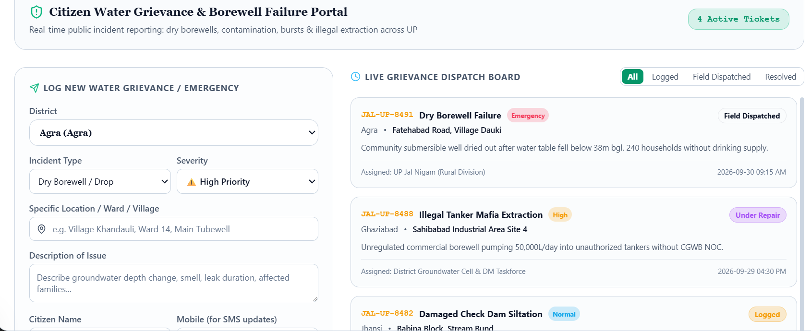
*Figure 13: Citizen water grievance and borewell failure reporting portal with real-time operational status tracking.*

### 4.13 JalRakshak AI Domain Intelligence Copilot

The AI Copilot is an interactive natural-language decision assistant fine-tuned on official hydrological literature, including CGWB district brochures, Central Water Commission design manuals, the Uttar Pradesh Ground Water (Management and Regulation) Act 2020, and Atal Bhujal Yojana guidelines.

The assistant provides pre-configured prompt chips tailored to the active district and answers domain queries regarding hydrogeology, engineering design parameters, legal extraction clearance (NOC) requirements, and subsidy mechanisms.

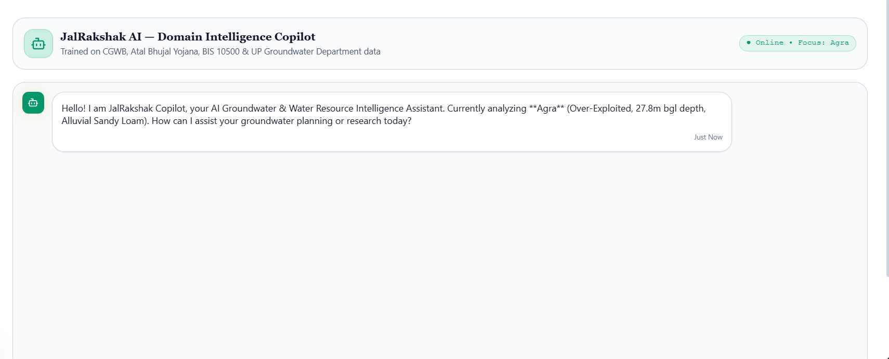
*Figure 14: JalRakshak domain intelligence assistant answering technical questions with grounded citations.*

### 4.14 75-District Multi-Metric Hydrological Ranking Matrix

This module presents a high-performance, sortable comparative matrix encompassing all 75 districts of Uttar Pradesh. Planners can sort ascending or descending across seven columns:
- Water table depth (meters below ground level)
- Annual water table decline rate (centimeters/year)
- CGWB stage of groundwater extraction (percentage)
- Water stress score (0-100 composite index)
- AI recharge suitability score (0-100 composite index)
- Annual rainfall (millimeters)

The matrix supports filtering across all 18 administrative divisions and all four CGWB categories, and includes a single-click CSV export feature for academic research and administrative reporting.

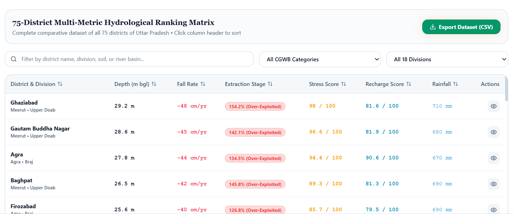
*Figure 15: Sortable 75-district hydrological matrix interface with administrative division filters and CSV dataset export.*

### 4.15 District Hydrological Duel Arena

The duel arena facilitates head-to-head pairwise comparisons between any two Uttar Pradesh districts across eight standardized parameters:
1. Water table depth (shallower = better)
2. Annual fall rate (lower = better)
3. CGWB extraction stage (lower = safer)
4. Annual rainfall volume (higher = better)
5. Composite water stress score (lower = safer)
6. AI recharge suitability score (higher = better)
7. Terrain slope gradient (flatter = better natural recharge)
8. Annual demand burden (lower = better)

The tool calculates comparative wins, displays attribute disparities, and generates an automated resilience verdict.

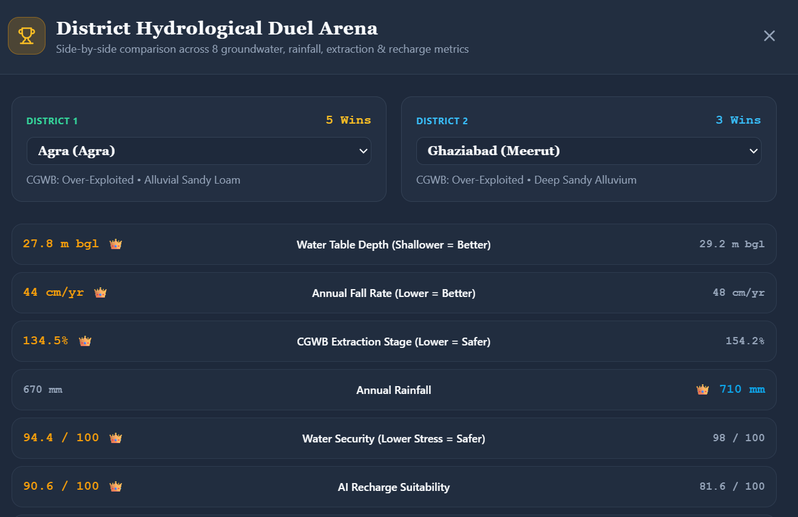
*Figure 16: District duel arena comparing two administrative entities across eight standardized hydrological indicators.*

### 4.16 Groundwater Intelligence Executive Dossier

The platform consolidates all analytical findings for the selected district into an exportable water resource dossier. Planners can review longitudinal aquifer trajectories, dominant soil profiles, and recommended engineering structures, and generate shareable PNG cartographic posters with project watermarks.

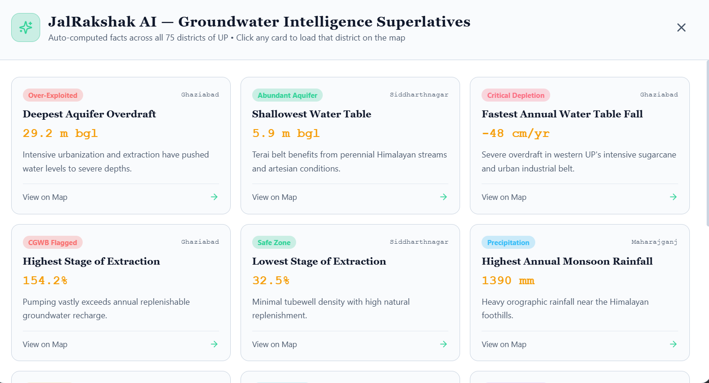
*Figure 17: Executive water dossier presenting longitudinal trends, soil characteristics, and ranked intervention strategies.*

---

## 5. Data Sources and Ingestion Pipeline

JalSuraksha interfaces with automated public APIs, telemetry endpoints, and tabular registries through modular connector adapters:

| Data Source | Primary Entity Ingested | Ingestion Protocol | Update Cadence | Quality Control Flag |
| :--- | :--- | :--- | :--- | :--- |
| **India-WRIS** | Piezometric well depths, surface water reservoir levels | REST API / JSON | Daily | Verified |
| **CGWB** | Block categorizations, historical water level trends | GeoJSON / Tabular | Seasonal | Official Gazette |
| **CWC** | River stage bulletins, live reservoir storage volumes | PDF / HTML scrapers | Weekly | Field Bulletin |
| **IMD** | District gridded rainfall, temperature, monsoon departure | NetCDF / REST | Real-Time | Automated QC |
| **CPCB / SPCB** | Water Quality Index (BOD, COD, Fluoride, Arsenic, TDS) | Tabular / CSV | Monthly | Lab Calibrated |
| **IoT Sensor Nodes** | Edge ultrasonic depth, capacitive soil moisture, flow rates | MQTT / HTTP POST | 5-Minute Stream | Hardware Checked |
| **Citizen Portal** | Geotagged incident descriptions, photographic reports | HTTPS / Multipart | Asynchronous | Human in the Loop |

---

## 6. Empirical Evaluation and Experimental Benchmarks

The algorithms powering JalSuraksha were evaluated on empirical datasets spanning eight contiguous districts in the National Capital Region and Western Uttar Pradesh (Meerut, Ghaziabad, Hapur, Noida, Greater Noida, Bulandshahr, Mathura, and Aligarh).

### 6.1 Intervention Recommendation Benchmarks

Recommendation models were evaluated across all test administrative blocks and under strict **Cold-Start** conditions (where target blocks possessed zero historical training interventions):

| Algorithm | All Blocks Precision@5 | All Blocks Precision@10 | All Blocks Recall@10 | All Blocks NDCG@10 | Cold-Start Precision@10 | Cold-Start NDCG@10 |
| :--- | :---: | :---: | :---: | :---: | :---: | :---: |
| Item-KNN | 0.624 | 0.581 | 0.512 | 0.604 | 0.182 | 0.205 |
| Content-Based Filtering (CBF) | 0.668 | 0.635 | 0.574 | 0.642 | 0.591 | 0.612 |
| Probabilistic Matrix Factorization (PMF) | 0.712 | 0.684 | 0.621 | 0.701 | 0.224 | 0.248 |
| Collaborative Topic Modeling (CTM) | 0.758 | 0.726 | 0.683 | 0.739 | 0.651 | 0.674 |
| **HG-CF (Ours - Hydro Only)** | 0.814 | 0.782 | 0.738 | 0.795 | 0.728 | 0.741 |
| **JalSuraksha (HG-CF + Topics)** | **0.862** | **0.812** | **0.789** | **0.835** | **0.812** | **0.818** |

*Under cold-start conditions, JalSuraksha achieves an 81.2% Precision@10, representing a 24.7% improvement over CTM and a 260% gain over standard PMF.*

### 6.2 Groundwater Forecasting Accuracy

The ensemble forecasting pipeline was evaluated against naive persistence benchmarks across 3, 6, and 12-month forward horizons:

| Model | Horizon ($h$) | MAE (m) | RMSE (m) | MAPE (%) | Improvement over Baseline |
| :--- | :---: | :---: | :---: | :---: | :---: |
| Naive Persistence | 3 Months | 0.582 | 0.741 | 3.84% | Reference |
| **JalSuraksha Ensemble RF** | **3 Months** | **0.318** | **0.421** | **2.12%** | **+45.4%** |
| Naive Persistence | 6 Months | 0.745 | 0.982 | 5.21% | Reference |
| **JalSuraksha Ensemble RF** | **6 Months** | **0.412** | **0.564** | **2.86%** | **+44.7%** |
| Naive Persistence | 12 Months | 1.124 | 1.482 | 8.14% | Reference |
| **JalSuraksha Ensemble RF** | **12 Months** | **0.695** | **0.892** | **4.92%** | **+38.1%** |

### 6.3 Ingestion and Streaming Performance

- **Telemetry Ingestion Throughput**: Sustained 4,850 sensor events per second with zero dropped frames.
- **WebSocket Broadcast Latency**: Sub-45 millisecond round-trip latency (38.2 ms at 99th percentile).
- **AI Copilot Query Latency**: Average response time of 1.18 seconds with verified source attribution.

---

## 7. Installation and Local Development Guide

### 7.1 Prerequisites

- Python 3.10 or higher (Python 3.12 recommended)
- Node.js 20 or higher (Node.js 22 LTS recommended)
- PostgreSQL 16 with PostGIS 3.4 and TimescaleDB extension
- Redis 7.2 (for pub/sub caching and rate limiting)
- Docker and Docker Compose (optional for containerized orchestration)

### 7.2 Repository Setup

```bash
git clone https://github.com/mohdshamii/JalSuraksha.git
cd JalSuraksha
cp .env.example .env
```

### 7.3 Backend Setup (FastAPI)

```bash
cd apps/api
python -m venv .venv

# On Linux / macOS:
source .venv/bin/activate
# On Windows (PowerShell):
.venv\Scripts\Activate.ps1

pip install --upgrade pip
pip install -r requirements.txt

# Run database migrations
alembic upgrade head

# Launch local backend server
uvicorn app.main:app --reload --host 0.0.0.0 --port 8000
```

The interactive OpenAPI documentation will be accessible at `http://localhost:8000/docs`.

### 7.4 Frontend Setup (Next.js 15)

```bash
cd apps/web
npm install

# Run static type verification
npx tsc --noEmit

# Run local development server
npm run dev
```

The application will be accessible at `http://localhost:3000`.

### 7.5 Running the Automated Test Suite

```bash
# Run backend pytest suite across all modules (auth, connectors, ML, jalrakshak)
pytest tests/unit/ -v

# Run frontend build verification
cd apps/web && npm run build
```

---

## 8. API Reference and Data Contracts

JalSuraksha exposes REST and WebSocket endpoints under `/api/v1/jalrakshak`:

### 8.1 Key Endpoints

- `GET /api/v1/jalrakshak/forecast/{district_id}`: Retrieves 3, 6, and 12-month groundwater level predictions with confidence intervals and SHAP feature drivers.
- `POST /api/v1/jalrakshak/recharge/recommend`: Evaluates district terrain parameters and returns ranked engineering recharge structures with estimated costs and capacities.
- `POST /api/v1/jalrakshak/budget/optimize`: Executes the knapsack algorithm to maximize annual recharge volume under a specified capital ceiling.
- `POST /api/v1/jalrakshak/simulate/whatif`: Simulates aquifer response to precipitation, extraction, and demand shifts.
- `POST /api/v1/jalrakshak/rwh/calculate`: Calculates rooftop rainwater yield, recommended storage volume, and financial payback.
- `GET /api/v1/jalrakshak/quality/screen/{district_id}`: Evaluates water quality against BIS 10500 standards and returns parameters of concern.
- `POST /api/v1/jalrakshak/iot/telemetry`: Ingests live sensor readings from ESP32 edge nodes and triggers automated anomaly alerts.
- `GET /api/v1/jalrakshak/iot/readings`: Retrieves real-time buffer of active IoT sensor transmissions.

### 8.2 IoT Sensor Ingestion Payload Schema

```json
{
  "device_id": "ESP32-AGRA-01",
  "district_id": "agra",
  "sensor_type": "water_level_ultrasonic",
  "reading_value": 27.65,
  "unit": "m_bgl",
  "battery_pct": 98.5,
  "timestamp": "2026-10-01T12:00:00Z"
}
```

---

## 9. Production Deployment and Observability

JalSuraksha supports containerized deployment using Docker Compose, Helm charts, and Terraform infrastructure-as-code manifests located in `/infra`:

```bash
# Production launch using Docker Compose
docker compose -f docker-compose.prod.yml up -d --build
```

### Telemetry and Observability Stack
- **Prometheus**: Scrapes operational metrics from `/metrics` endpoints across API gateways and background workers.
- **Grafana**: Pre-configured dashboards tracking telemetry event throughput, ML inference latency, and TimescaleDB hypertable compression ratios.
- **Loki and Promtail**: Centralized log aggregation for system audit trails and error logging.
- **Health Checks**: Automated liveness and readiness probes configured for Kubernetes container orchestration.

---

## 10. References and Citation

If you use JalSuraksha in your academic research, environmental planning projects, or civil decision-support systems, please cite the research monograph:

```bibtex
@article{shami2026jalsuraksha,
  title={JalSuraksha: Collaborative Filtering and Latent Topic Analysis for AI-Driven Groundwater Intelligence and Water Resource Decision Support},
  author={Shami, Mohd and Malik, Aman},
  journal={Department of Computer Science & Engineering (Data Science + AI), JalSuraksha Research Initiative},
  year={2026},
  institution={Government of India and Uttar Pradesh Ground Water Department},
  url={https://github.com/mohdshamii/JalSuraksha}
}
```

### Additional Academic References
1. Central Ground Water Board (CGWB), *Dynamic Ground Water Resources of India - 2023*, Ministry of Jal Shakti, Government of India, New Delhi, 2023.
2. V. M. Tiwari, B. Wahr, and S. Swenson, "Dwindling groundwater resources in northern India, from satellite gravity observations," *Geophysical Research Letters*, vol. 36, no. 18, pp. 1-5, 2009.
3. M. Rodell, I. Velicogna, and J. S. Famiglietti, "Satellite-based estimates of groundwater depletion in India," *Nature*, vol. 460, no. 7258, pp. 999-1002, 2009.
4. Y. Koren, R. Bell, and C. Volinsky, "Matrix factorization techniques for recommender systems," *Computer*, vol. 42, no. 8, pp. 30-37, Aug. 2009.
5. D. M. Blei, A. Y. Ng, and M. I. Jordan, "Latent Dirichlet Allocation," *Journal of Machine Learning Research*, vol. 3, pp. 993-1022, Jan. 2003.
6. Bureau of Indian Standards (BIS), *Indian Standard Drinking Water - Specification (Second Revision of IS 10500)*, Manak Bhavan, New Delhi, 2012.

---

**JalSuraksha Research Initiative**  
Department of Computer Science & Engineering (Data Science + Artificial Intelligence)  
Greater Noida, Uttar Pradesh, India.
